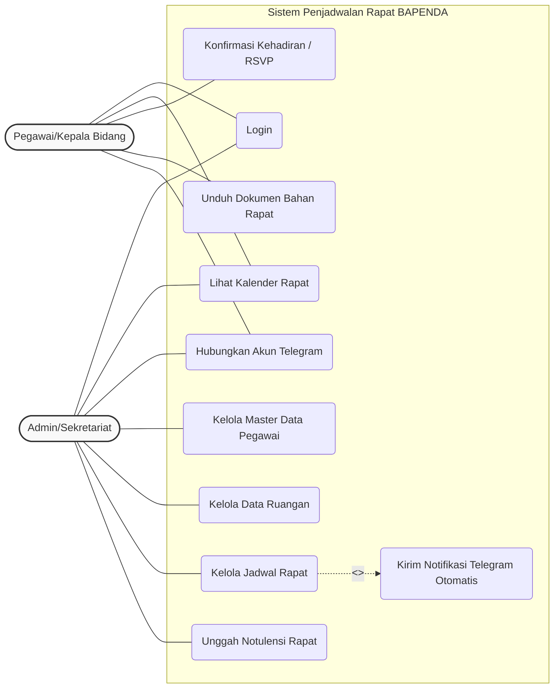
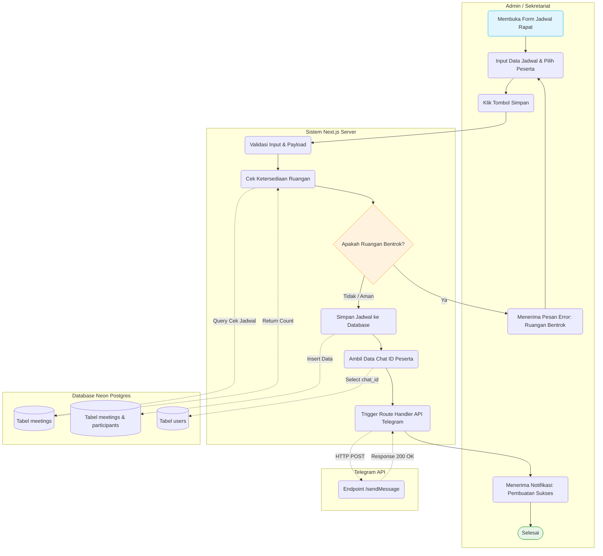
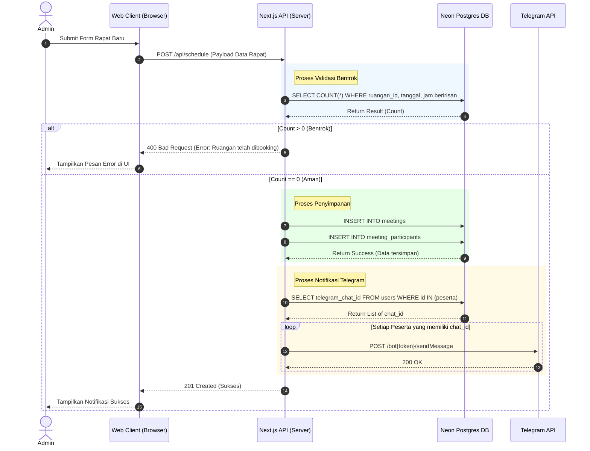
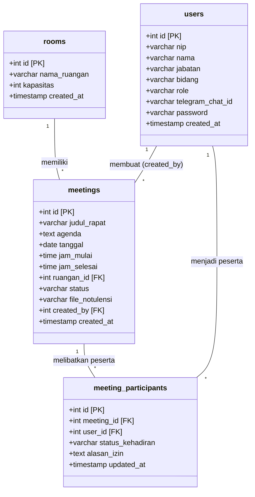

# Unified Modeling Language (UML) Diagrams

Dokumen ini berisi kumpulan diagram UML (Use Case, Activity, Sequence, dan Class Diagram) untuk **Sistem Informasi Penjadwalan dan Agenda Rapat BAPENDA Kabupaten Tangerang Berbasis Web Terintegrasi Telegram Notification**. Diagram-diagram ini dirancang berdasarkan PRD (Product Requirement Document) dan SDD (System Design Document) yang telah disepakati.

---

## 1. Use Case Diagram

Use Case Diagram menggambarkan interaksi antara aktor dengan sistem. Terdapat dua aktor utama: **Admin / Sekretariat** dan **Pegawai / Kepala Bidang**. Diagram ini menunjukkan batasan sistem dan fungsi-fungsi apa saja yang dapat diakses oleh masing-masing aktor.

**Penjelasan Singkat:**
- Baik Admin maupun Pegawai wajib melakukan **Login** untuk mengakses sistem.
- Pegawai memiliki hak untuk melihat kalender, RSVP (Hadir/Izin/Absen), mengunduh dokumen rapat, dan menghubungkan akun Telegram mereka.
- Admin memiliki akses manajemen penuh termasuk kelola data pegawai, ruangan, rapat, dan unggah notulensi.
- Setiap kali Admin berhasil melakukan pembuatan/perubahan jadwal rapat (**Kelola Jadwal Rapat**), sistem secara otomatis memicu proses **Kirim Notifikasi Telegram Otomatis** (`<<include>>`).

---

## 2. Activity Diagram

Activity Diagram ini secara khusus memetakan alur proses **Pembuatan Jadwal Rapat & Pengiriman Notifikasi**, mulai dari Admin mengisi formulir hingga sistem mengirimkan pesan Telegram kepada para peserta.

---

## 3. Sequence Diagram

Sequence Diagram menunjukkan interaksi antar objek atau komponen sistem (Client, Server Next.js, Database, dan API Telegram) berdasarkan urutan waktu. Diagram ini membedah alur sistem dari Request hingga Response untuk fungsi pembuatan jadwal.

---

## 4. Class Diagram

Class Diagram ini merepresentasikan arsitektur basis data relasional (*Entity Relationship*) yang dibangun di atas Neon PostgreSQL. Relasi yang digambarkan di bawah sesuai dengan skema database yang telah dirancang menggunakan ORM Prisma/Drizzle.

**Penjelasan Relasi antar Tabel / Entitas:**
- **`rooms` (1) ke `meetings` (*):** Hubungan *One-to-Many*. Sebuah ruangan dapat digunakan untuk berbagai jadwal rapat, tetapi satu jadwal rapat pada satu waktu hanya bisa menempati satu ruangan (diikat oleh `ruangan_id`).
- **`users` (1) ke `meetings` (*):** Hubungan *One-to-Many*. Seorang Admin (`users`) dapat membuat banyak jadwal rapat (diikat oleh `created_by`).
- **`users` (*) ke `meetings` (*) via `meeting_participants`:** Hubungan *Many-to-Many*. Satu rapat dihadiri banyak pegawai, dan seorang pegawai dapat menghadiri banyak rapat. Tabel `meeting_participants` bertindak sebagai *Pivot/Junction Table* untuk menyimpan informasi detail peserta di setiap rapat (seperti `status_kehadiran` dan `alasan_izin`).
