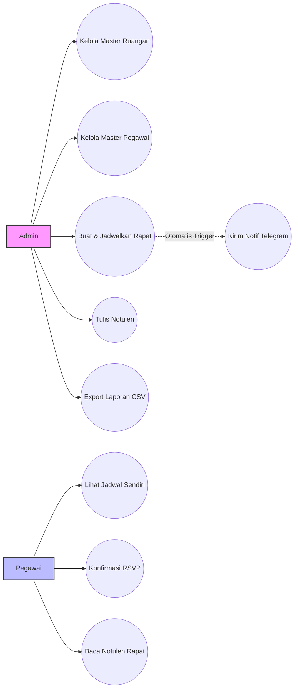
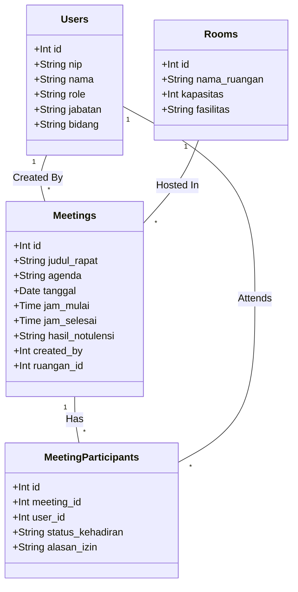
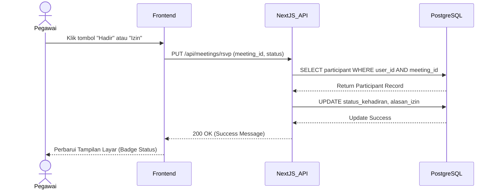

# Dokumentasi Sistem Manajemen Rapat BAPENDA

**Sistem Manajemen Rapat BAPENDA** adalah sebuah aplikasi perangkat lunak berbasis *web* skala *Enterprise* yang dirancang khusus untuk mengelola, menjadwalkan, dan mendokumentasikan seluruh kegiatan rapat di lingkungan instansi pemerintahan (BAPENDA). Aplikasi ini memadukan kemudahan antarmuka modern dengan keandalan *backend* yang mampu menangani notifikasi *real-time* serta pencegahan konflik jadwal.

---

## 🌟 Ringkasan Fitur (Features Summary)

1. **Dashboard & Analytics**
   - Panel kontrol yang menampilkan kartu statistik jumlah rapat (Bulan ini & Keseluruhan), ruangan terfavorit, serta grafik area historis frekuensi rapat.
2. **Manajemen Master Data (CRUD)**
   - **Ruangan:** Pengelolaan ruangan rapat beserta kapasitas maksimal dan fasilitasnya.
   - **Pegawai:** Pengelolaan data akun pegawai, NIP, Jabatan, Bidang, dan penentuan akses (*Role*).
3. **Penjadwalan Rapat Cerdas (Smart Scheduling)**
   - **Deteksi Bentrok:** Mencegah Admin membuat rapat di ruangan yang sama pada waktu yang tumpang tindih.
   - **Validasi Kapasitas:** Menolak pembuatan rapat jika jumlah undangan melebihi kapasitas ruangan.
4. **Sistem Notifikasi Telegram**
   - Terintegrasi langsung dengan Telegram Group. Saat rapat baru dibuat, sistem secara otomatis menyiarkan (*broadcast*) undangan ke grup Telegram yang memuat detail waktu, tempat, agenda, dan daftar peserta.
5. **Konfirmasi Kehadiran (RSVP)**
   - Peserta yang diundang dapat memberikan konfirmasi **Hadir** atau **Izin** (beserta alasan) langsung dari *dashboard* mereka.
6. **Notulensi Digital & Cetak (Meeting Minutes)**
   - Admin/Notulis dapat mengetikkan hasil keputusan rapat secara langsung di aplikasi.
   - Fitur **Cetak (Print)** pintar yang siap mengubah hasil notulen menjadi dokumen PDF/kertas arsip yang rapi.
7. **Export Laporan (CSV)**
   - Fitur rekapitulasi data yang memungkinkan admin mengunduh seluruh data riwayat rapat ke dalam format Microsoft Excel (.csv).

---

## 🔐 Hak Akses & Role (Role-Based Access Control)

Sistem ini membagi pengguna ke dalam dua *role* utama dengan hak akses yang terisolasi dengan ketat:

### 1. Administrator (`admin`)
Bertindak sebagai pengelola sistem (Sekretariat/Pimpinan).
- **Akses:** Akses penuh ke seluruh menu (`/dashboard`, `/dashboard/meetings`, `/dashboard/rooms`, `/dashboard/users`).
- **Wewenang:** 
  - Melihat *Dashboard Analytics*.
  - Menambah, mengubah, menghapus data Ruangan dan Pegawai.
  - Membuat Rapat Baru dan Menulis Notulen.
  - Melakukan *Export* data rapat.

### 2. Pegawai Biasa (`pegawai`)
Bertindak sebagai pengguna akhir/peserta rapat.
- **Akses:** Terbatas pada menu Dashboard Ringkas dan Data Rapat (`/dashboard`, `/dashboard/meetings`). Menu master data disembunyikan dan dikunci dari API.
- **Wewenang:**
  - Hanya dapat melihat rapat di mana namanya terdaftar sebagai peserta terundang.
  - Melakukan klik tombol **Hadir / Izin**.
  - Membaca hasil Notulen rapat (tetapi tidak bisa mengubahnya).

---

## 🔄 App Flow / Use Flow

**1. Flow Pembuatan Rapat (Admin)**
Admin Login ➔ Buka Menu `Data Rapat` ➔ Klik `Buat Rapat Baru` ➔ Isi Detail, Pilih Ruangan & Peserta ➔ Klik Simpan ➔ *Sistem memvalidasi kapasitas & bentrok* ➔ Jika Lolos, Rapat tersimpan ➔ *Sistem mengirim pesan ke Grup Telegram* ➔ Selesai.

**2. Flow Konfirmasi Kehadiran (Pegawai)**
Pegawai Login ➔ Buka Menu `Data Rapat` ➔ Melihat daftar kartu rapat miliknya ➔ Klik tombol `Hadir` atau `Izin` ➔ *Sistem memperbarui status kehadiran* ➔ Selesai.

**3. Flow Pencatatan Notulen (Admin/Notulis)**
Admin Buka Menu `Data Rapat` ➔ Cari Rapat yang sudah selesai ➔ Klik `Buka Notulen` ➔ Ketik ringkasan rapat ➔ Klik `Simpan Notulen` ➔ Klik `Cetak` jika butuh arsip fisik.

---

## 📐 UML Diagrams

Berikut adalah representasi arsitektur sistem dalam bentuk diagram UML.

### 1. Use Case Diagram
Diagram ini memetakan interaksi antara *aktor* (Admin dan Pegawai) dengan fungsionalitas sistem.

### 2. Class Diagram (Entity Relationship)
Diagram ini menjelaskan struktur pangkalan data (Database Schema) dan relasi antar entitas (tabel).

### 3. Activity Diagram (Proses Buat Rapat)
Alur aktivitas (*flowchart*) ketika Admin membuat jadwal rapat, mencakup validasi cerdas di sisi *backend*.

```mermaid
stateDiagram-v2
    [*] --> FormBuatRapat : Admin klik "Buat Rapat"
    FormBuatRapat --> ValidasiSistem : Submit Data (POST)
    
    state ValidasiSistem {
        [*] --> CekKapasitas
        CekKapasitas --> CekBentrok : Kapasitas Aman
        CekKapasitas --> ErrorKapasitas : Peserta > Kapasitas
        CekBentrok --> SimpanDatabase : Ruangan Tersedia
        CekBentrok --> ErrorBentrok : Jadwal Tumpang Tindih
    }
    
    ErrorKapasitas --> FormBuatRapat : Tampilkan Pesan Peringatan
    ErrorBentrok --> FormBuatRapat : Tampilkan Pesan Peringatan
    
    SimpanDatabase --> BroadcasTelegram : Simpan Data ke Tabel
    BroadcasTelegram --> [*] : Rapat Berhasil Dibuat
```

### 4. Sequence Diagram (Proses RSVP Hadir/Izin)
Urutan pesan waktu-nyata antara *Client* (Pegawai), *Server* (API), dan *Database* saat melakukan absensi.

